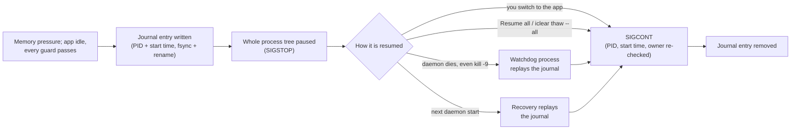
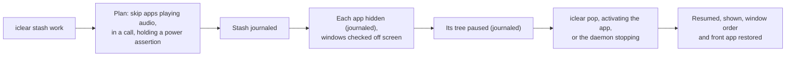

# iClear (formerly iClean)

Pauses idle background apps on a Mac that is running out of memory and resumes each one
when you switch back to it. It never deletes files.

[](https://github.com/urrra39/iClear/actions/workflows/ci.yml)
[](https://github.com/urrra39/iClear/releases/latest)
[](LICENSE)


> **Latest release: 1.0.2.** Validated on one Mac (Apple M3 Pro, 18 GB, macOS 27.0.1) with
> real apps a lab started, never with personal accounts. `main` also holds the
> **1.1.0-rc.1** work, which is **not released**: anything marked "main only" below is not
> in a download. The CI badge is red because GitHub has not run any job since 2026-10-06
> (an account billing lock), not because a test failed; local runs are listed in
> [QUALITY.md](docs/QUALITY.md). iClear starts in **Observe mode**: it only records what it
> would do. [Oʻzbekcha](README.uz.md) · [Status and limits](#status-and-limits)

<p align="center"></p>

```text
$ iclear status
iClear observe mode, profile work. Mac Health 100/100 (good).
Memory pressure normal, 74% available, 2260 MB compressed, 0 MB swap. Forecast: stable.
Nothing frozen.
Observe mode: iClear only records what it would do.
$ iclear why
Mac Health: 100/100 (good). Forecast: stable.
Your Mac is healthy; iClear is idle.
```

A paused app keeps its windows, tabs and unsaved state; it just stops running, so macOS
can compress or swap its memory instead of fighting it for RAM. When memory pressure is
normal, iClear does nothing. It removes no caches, logs or downloads, and it does not add
memory: it only changes which apps use the memory you have.

## Why iClear

Every line is a measurement from the lab on one Mac; follow the link for N and conditions.

- **Crash-safe by design.** Every pause is written to a journal before it happens, and a
  separate watchdog resumes everything if the daemon dies: after `kill -9`, 100/100 trials
  with apps paused (p99 83 ms) and 50/50 with a stash active (p99 98 ms) had every app
  running again within 2 s. [Evidence](docs/VALIDATION.md#crash-recovery-c2)
- **Tested on real apps.** 1,200 pause/resume cycles of Chrome, VS Code, TextEdit and
  Preview, 400 of them under induced memory pressure: 0 hangs, 0 crash reports, 0 document
  changes. [Evidence](docs/VALIDATION.md#soak-on-real-apps-c1-c3-c4-c5-c6)
- **Quick to resume.** In those cycles the app answered again within 15.1 ms at p99
  (max 47.3 ms). [Evidence](docs/VALIDATION.md#soak-on-real-apps-c1-c3-c4-c5-c6)
- **A stash keeps your layout.** 50 stash/pop cycles of 4 apps: 350/350 windows back in
  place, the previous front app back in front 50/50. [Evidence](docs/VALIDATION.md#stash-and-pop-c7)
- **Guards before every pause.** 123 of 123 pause attempts were refused while audio played, a call
  used the microphone or a download ran. [Evidence](docs/VALIDATION.md#guards-e2-every-freeze-attempt-during-audio-a-call-or-a-download-was-blocked)
- **Private by construction.** No root, no kernel extension, no network access, no
  telemetry, no screen recording; tests check the product code for networking and
  privilege APIs. [Safety model](docs/SAFETY.md)
- **Starts in Observe mode and explains itself.** It does nothing until you switch it on, and
  `iclear why`, `iclear explain <app>` and `iclear stats` say what it saw and would have done.
  `iclear selftest` runs 19 checks on your Mac with its own test processes (main; 13 in
  1.0.2). [Validation](docs/VALIDATION.md#selftest-c13)
- **English and Uzbek**, in the menu and the docs.

## Start in 60 seconds

```sh
iclear selftest --quick # quick check that pausing and resuming work on this Mac
iclear install          # starts the per-user daemon, in Observe mode
iclear status           # what it sees and would do
iclear why              # why is my Mac slow right now?
# ...use your Mac for a day, then:
iclear stats --days 1   # what it would have done, and its would-be regret rate
iclear mode active      # let it act
```

With the app, open iClear from Applications; "Start iClear" installs the daemon.
**Emergency:** Resume all in the menu, Control-Option-Command-T while the menu app runs, or
`iclear thaw --all`. All three resume every app iClear paused, also without the daemon.
`iclear selftest` uses the microphone for one check (its own test tool, a few seconds,
discarded); on `main`, `--no-mic` skips that check.

## Features

| Feature | Default | Status |
|---|---|---|
| Pause and resume idle background apps under memory pressure | Observe mode until `iclear mode active` | released, validated (lab) |
| Workspace Stash: `iclear stash <name>`, `iclear pop` | when you ask | released, validated (lab) |
| App classes and guards (`iclear compat <app>`): chat, mail, calendar and media never paused by default; nothing paused while it plays audio, uses the microphone or camera, downloads or writes | on | released, validated (lab) |
| `iclear why`, Mac Health score, runaway guard (tells you only) | on | released |
| `iclear selftest`, `iclear doctor`, `iclear before <app>`, digest, explain, Undo, profiles, Focus Safe Mode | on | released |
| Anti-Beachball forensics (`iclear beachball`) | on, needs Accessibility | released |
| Battery estimates (`iclear battery`) | shown, labelled "estimate"; target mode off | released, **not validated** |
| Call Mode, Anti-Beachball mitigation, thermal shield | **off** | released, off by their ship rules ([VALIDATION](docs/VALIDATION.md#paired-runs-c8)) |
| Auto-Context Stash (`iclear context`, `iclear hook`) | suggest mode | **main only**, not validated |
| Leak trend (`iclear leaks`) | list only; notifications off | **main only**, notifications off by rule L5 |
| Panic Brake (`iclear brake`) | **observe only** | **main only**, cannot act until its lab criteria pass |
| Black Box (`iclear blackbox`), Thrash Guard, Wake-on-Data | **off** | **main only**, off until their lab criteria pass |
| Canary probe (`iclear probe`), Capacity Report (`iclear capacity`) | when you ask | **main only**, not validated |

Details of the main-only features and of what they cannot do: [below](#features-on-main-not-released).

## Safety model



A protected set (system apps, terminals, coding-agent hosts, password managers, sync,
VPN, input and accessibility tools) is never paused by any rule. Trees are paused
all-or-nothing; pauses are limited to 4 hours and 50% of RAM; priority and hidden-state
changes are journaled and put back exactly. On `main` the journal also takes a lock that
every iClear process shares, and an entry is removed only once the process is seen
running again or is gone. Details and the test for each rule: [SAFETY.md](docs/SAFETY.md).



## Validated scope

<details>
<summary><b>16 of 16 must-pass criteria for 1.0.0 met on one Mac; CI then green on macOS 15 (Apple Silicon and Intel) and macOS 26.</b> Expand for the numbers.</summary>

| Validated (lab, one Mac) | Result |
|---|---|
| Pause and resume of real apps (Chrome, VS Code, TextEdit, Preview): 300 cycles per app, 100 under 8 GB of induced pressure | 0 hangs, 0 left paused, 0 document changes, 0 crash reports; responsive again within 15.1 ms (p99) |
| Daemon killed with `kill -9` while apps were paused (100 times) | 100/100 running again within 2 s; p50 76 ms, p99 83 ms |
| Daemon killed with `kill -9` while a stash was active (50 times) | 50/50 running and shown again within 2 s; p50 85 ms, p99 98 ms |
| Stash and pop, 50 cycles of 4 apps | windows back within 0.0 points (350/350); previous front app restored 50/50; 0 left paused or hidden |
| Guards while a player plays, a call uses the microphone, or Chrome downloads | 123 of 123 freeze attempts refused |
| Pauses of 10-300 s: Chrome tabs, chat clients | no data lost; Chrome and a chat client with a heartbeat recovered in about 1.1 s; a client without one stayed offline (chat apps are therefore protected) |
| Memory frozen real apps gave back at "warning" pressure (first episode) | Chrome 1,203 → 803 MB (−33%), VS Code 1,709 → 1,046 MB (−39%), Preview 130 → 84 MB (−35%); at "normal" pressure macOS reclaims little (median −1% to −4%) |
| Pop until every stashed app is shown | p50 1.34 s, p99 1.36 s |
| 60-minute run with every feature on, Active lab daemon | 0 failures: 12/12 stash/pop cycles, 6 pressure episodes, 6/6 simulated calls detected, 0 hangs |
| `iclear selftest` (full) | 1.0.0: 13 of 13; main (1.1.0-rc.1 build): 19 of 19, no skip |
| Tests | 1.0.x: 188, green on three CI runners; main: 328, passing locally (CI not run, see above); ICCore line coverage 97.3% |

All criteria and results: [RELEASE_CRITERIA.md](docs/RELEASE_CRITERIA.md),
[VALIDATION.md](docs/VALIDATION.md), [QUALITY.md](docs/QUALITY.md). Everything without a
test is listed in [TEST_MATRIX.md](docs/TEST_MATRIX.md).

</details>

## Status and limits

**Validated** (lab, one Mac): pausing and resuming real apps, crash recovery, stash and
pop, the guards, and the side effects below. Numbers: [Validated scope](#validated-scope).

**Experimental or off, with the measured reason:**
- Call Mode: cut call-timer jitter (p99 0.32 → 0.08 ms) but halved other apps' work, so off.
- Anti-Beachball mitigation: made the UI probe 3.4% worse, so off.
- Thermal shield: could not be tested, so off.
- Battery target mode: no valid unplugged trials, so experimental and off.
- On `main`: Panic Brake observe only; Black Box, Thrash Guard, Wake-on-Data and leak
  notifications off, each until its pre-registered lab criteria pass
  ([RELEASE_CRITERIA_v1.1.md](docs/RELEASE_CRITERIA_v1.1.md)).

**Measured weakness: daemon CPU.** A 10-minute lab run of 1.0 measured 0.48% of one core
and 40 MB (bound 0.5%). The 7-day soak of 1.0.0 did not meet the bound: daily means of
0.73-2.03% of one core ([soak W5](docs/VALIDATION.md#7-day-soak-on-100-final-result-w1-w7)).
The main cause: a forecast estimate that is only shown, never acted on, still made the
daemon check every 5 s and inspect apps' sockets and files whenever free memory sat below
the warning level the forecast had learned. 1.0.2 and 1.1.0-rc.1 do this; it is fixed on
`main` (not released). Same Mac, Observe mode, real apps, 2 hours at night: rc.1 0.25%,
`main` 0.13-0.14% of one core, also when started from the soak's data (from which rc.1
used 0.95% in a 30-minute run below that level). The week-long bound has not been re-run
on `main` ([measurements](docs/VALIDATION.md#daemon-overhead-after-the-soak-w5-follow-up)).

**7-day soak of 1.0.0** (2026-10-01 to 2026-10-10): W1 elapsed time, W2 awake hours, W4
safety (0 left paused, 0 hangs) and W6 reports met; **W3 not met** (5,148 of 5,000
freeze/thaw cycles, but 160 of 300 stash/pop cycles); **W5 not met** (CPU, above). In 10
days of the owner's real use it would have paused one app once, and that pause would have
been regretted. [Full result](docs/VALIDATION.md#7-day-soak-on-100-final-result-w1-w7)

**Not validated** (help is welcome):
- Intel Macs: only the CI test suite ran there ([#3](https://github.com/urrra39/iClear/issues/3)).
- macOS 13 and 14 ([#4](https://github.com/urrra39/iClear/issues/4)).
- Macs with 8 GB or less ([#5](https://github.com/urrra39/iClear/issues/5)).
- Safari ([#6](https://github.com/urrra39/iClear/issues/6)), Docker and Xcode ([#7](https://github.com/urrra39/iClear/issues/7)) and virtual machines as pause targets.
- Real Slack, Spotify or any personal account ([#9](https://github.com/urrra39/iClear/issues/9)); [MANUAL_TESTS_APPS.md](docs/MANUAL_TESTS_APPS.md).
- fish and tmux with the Auto-Context hook ([#8](https://github.com/urrra39/iClear/issues/8)).
- Battery estimates; the unsaved-changes signal (no app reported it in the lab); media
  keys sent to a paused player; the thermal shield.
- The main-only features' lab gates (stages 4-6) and the capacity benchmark: not run yet.
- Developer ID signing and notarization: not done (see Install).

**When it does not help:** memory pressure is green (macOS handles it, iClear stays idle);
the memory belongs to the app you are using, or to something that must keep running (a
build, a model, a VM, a call); apps that sit idle without waking (macOS compresses those
anyway); or you are simply short of RAM for your daily work (`iclear advise` says so after
a week of data).

<details>
<summary><b>What pausing does to apps</b> (measured side effects and the defaults they led to)</summary>

Measured with simulators and Chrome on local pages ([VALIDATION.md](docs/VALIDATION.md),
"Side effects"); `iclear compat <app>` shows them for one app.

- **Chat, mail and calendar apps** are never paused unless you opt in. While paused an
  app receives nothing, and its server drops the connection once it stops answering (the
  lab's after 30 s). A simulated client with its own heartbeat reconnected about 1.1 s
  after resume and then received every missed message, late (up to 296 s after a 300 s
  pause), none lost. A client that relies only on the socket to notice the drop **stayed
  offline** after every pause of 60 s or more. Opt-in wake windows
  (`packaging/rules/chat-wake-windows.json`) cut the worst delay in the lab from 296 s to
  36 s, at the cost of more wake-ups; they are never refrozen during a call.
- **Media players** are never paused by default, never while playing, and not for 10
  minutes after. A paused player cannot answer media keys or Control Center; what macOS
  does then is a manual check.
- **Browsers**: paused only as a whole tree, and never while a tab plays audio, uses the
  microphone or camera, downloads, writes files, or holds a power assertion (Chrome
  holds one while a WebRTC connection is open). In the lab those guards refused every
  attempt to pause the test Chrome. When the lab paused it anyway for 10-300 s, every page
  answered within 0.03 s of resume, form input and timers survived, WebSocket pages
  reconnected within 1.1 s, and a WebRTC data channel and a service worker kept working.
  Chrome itself also freezes hidden, CPU-heavy tabs when Energy Saver is on (the Page
  Lifecycle "frozen" state, Chrome 133 and later) and, under Memory Saver, discards
  inactive tabs, which reload when you return to them.
- **"Not Responding"**: while paused, an app can show as "Not Responding" in Force Quit,
  Activity Monitor or its Dock menu. That is what a paused process looks like; activating
  it resumes it. Do not force-quit it.
- **Clocks and timers**: time keeps running during a pause. After resume, a repeating
  timer fires once (no burst), and timeouts that span the pause expire at once.
- **Dropped connections**: servers close connections they stop hearing from; recovery is
  up to the app (most chat apps reconnect, see above). Downloads are guarded: a 200 MB
  download finished with the correct checksum while every pause attempt was refused.
- **Notifications** due during a pause appear late or not at all (not measured).

</details>

### Permissions

| Permission | Required? | Used for | If denied |
|---|---|---|---|
| none | | pausing, resuming, stash, `why`, health score, guards, call detection (iClear reads only *whether* the microphone or camera is in use, never audio or video) | everything works |
| Accessibility | optional | checking that a resumed app answers; resume latency; stall forensics; bringing back the exact frontmost app after a pop. A stash also asks apps for unsaved changes this way, but no app reported them in the lab (each showed "unknown"), so that check is not validated | hangs after resume are not detected; latency and stalls show "not measured" |
| Input Monitoring | optional | experimental predictive resume (off by default) | nothing changes |
| Microphone | only for `iclear selftest` | its call check runs iClear's own test tool, which records a few seconds and discards them | that check is skipped (`--no-mic` on main) |
| Screen Recording, Camera | not used | | |

## Install

Built for macOS 13 and later, Apple Silicon and Intel (universal binary); tested only as
listed in [COMPATIBILITY.md](docs/COMPATIBILITY.md).

**Download** the [latest release](https://github.com/urrra39/iClear/releases/latest):
`iClear-<version>.zip` (the menu-bar app; command-line tools inside
`iClear.app/Contents/Helpers`) or `iclear-<version>-macos.tar.gz` (command-line tools
only). Check it:

```sh
shasum -a 256 -c SHA256SUMS.txt --ignore-missing
```

The builds are ad-hoc signed, not notarized, so Gatekeeper blocks the first launch. On
macOS 15 and later: open iClear.app once, then System Settings > Privacy & Security >
Open Anyway (Apple removed the right-click route in macOS 15). On macOS 13 and 14:
right-click iClear.app, choose Open, confirm. Command-line tools:
`xattr -dr com.apple.quarantine iclear-<version>`, then `./iclear install` inside it.

**From source** (a Swift 6 toolchain; `main` builds the unreleased 1.1.0-rc.1 work):

```sh
git clone https://github.com/urrra39/iClear.git && cd iClear
scripts/build-release.sh           # universal binaries, dist/iClear.app
cp -R dist/iClear.app /Applications/
```

A Homebrew tap is not published yet ([#11](https://github.com/urrra39/iClear/issues/11));
templates are in [`packaging/homebrew/`](packaging/homebrew/).

### Uninstall

```sh
iclear uninstall --purge   # stops the daemon (resuming everything), removes the
                           # LaunchAgent and deletes ~/Library/Application Support/iClear
rm -rf /Applications/iClear.app
```

### Migrating from iClean

iClear is the new name of iClean. If iClean 0.1.0 is installed, `iclear install` (or
`iclear migrate`) first resumes anything iClean had paused (through its daemon if it
still runs, then by replaying its freeze journal), and only then unloads and disables
the old LaunchAgent and copies your settings, state and traces. It stops without
changing anything if a process from the old journal is still paused. Old files stay
where they are until you run `iclear migrate --remove-old`. `iclear migrate --dry-run`
shows the plan first.

## Features on main (not released)

<details>
<summary>Auto-Context Stash, leak trend, Panic Brake, Black Box, canary probe, Capacity Report, Wake-on-Data, Thrash Guard: what each does and cannot do</summary>

Their lab runs ([RELEASE_CRITERIA.md](docs/RELEASE_CRITERIA.md) stage 4,
[RELEASE_CRITERIA_v1.1.md](docs/RELEASE_CRITERIA_v1.1.md) stages 5 and 6) have not run yet.
Until a feature's criteria pass, the default install runs it observe-only or off, whatever
its config says.

- **Auto-Context Stash** (`iclear hook zsh|bash|fish`, `iclear context add | list |
  remove | status | pause | resume | undo | suggest`). A small shell hook tells iClear
  which directory your terminal is in. After 20 s in another project, iClear *suggests*
  one switch: stash the apps of the project you left (as `context:<name>`) and pop the
  apps of the new one. Apps both projects use stay running, and so do apps that cannot
  be paused (audio, microphone, calls); a hard block, such as too little disk, stops the
  whole switch. Automatic switching is opt-in per context and works only in Active mode;
  Observe mode only records "would switch". Moves inside a project, `cd ~` and `/tmp`
  do not switch; a 5-minute cooldown follows each switch; `iclear context undo` reverses
  the last one. A switch is not instant: it takes about as long as a pop (p50 1.34 s in
  the 1.0 lab). Limits: it sees terminals only, so work done only in an IDE is not seen;
  when terminals in different projects report within the dwell time, the current context
  stays; fish, tmux and other multiplexers are not tested. In the spike the hook added
  about 1-2 ms per directory change (zsh and bash).
- **Leak trend** (`iclear leaks`; menu: Growth). Samples each app's memory footprint
  once a minute and reports steady growth while the app is not in use (not frontmost in
  the last 10 minutes), after at least 2 hours and 12 samples: "growth of X MB/h
  (interval), at this rate Y GB around HH:MM", with a confidence level. It is a trend,
  not a leak diagnosis: caches and logs grow too. A single step (a document opened) and
  caches that fill and empty are not reported. The history is kept in memory and starts
  again when the daemon restarts. Notifications are off: the retrospective check on the
  soak's 10-day trace flagged no app, so rule L5 cannot pass from it. `iclear leaks quit
  <app>` shows a preview; with `--yes` it asks the app to quit through its own Quit and
  does not force it. There is no "flush" button: macOS offers no way to make another app
  free memory.
- **Panic Brake** (`iclear brake observe | on | off | status | report | resume | quit`).
  A small separate watchdog (`icbrake`, its own LaunchAgent, no AppKit) reads memory
  pressure, swap-ins, decompressions, page-ins, the run queue and its own timer lateness
  every 250 ms. In a memory stall it ranks your own process trees by footprint growth,
  page-ins and CPU and would pause the top one (journaled first); if the stall clears it
  keeps it paused, otherwise it resumes it and tries the next (up to 3), and at 10 s it
  stops and notifies. The foreground app is a candidate only after 10 s and only as the
  top culprit. **In this version it only observes:** `iclear brake on` is saved but does
  not make it act until its criteria pass. Optional per app, off by default: an app in
  `brake.autoQuitApps` that stays the confirmed culprit for 30 s is asked to quit with
  its own Quit (tested end to end through the daemon); this is skipped when the app
  reports unsaved work, but in the 1.0 lab no app reported that signal, so an app without
  a reliable signal can lose unsaved work: opt in only apps that autosave and restore
  their windows. It cannot fix kernel, GPU/driver or WindowServer hangs, hardware
  faults, or root-owned processes such as Spotlight (`mds`), Time Machine (`backupd`) or
  `kernel_task`, and a Mac that is fully frozen cannot be rescued by any app. How fast
  it brings a Mac back is not measured yet.
- **Black Box** (`iclear blackbox`, off). The last ~5 minutes at 2 s resolution
  (pressure, swap, page-ins, thermal and power state, and the top suspects by app name),
  written only while the Mac is not healthy, shown after a restart without a clean
  shutdown. The last few seconds may be missing.
- **Canary probe** (`iclear probe <app> [--cycles N]`). With your approval and only while
  the app is hidden, not in front, passing every guard and on AC: a few short journaled
  pauses; after each it checks that the app is alive, answers and kept its connections,
  and looks for new crash reports. A failure quarantines the app.
- **Capacity Report** (`iclear capacity`). Per pause episode, the measured change in
  available memory 60 s after pausing, with a headroom estimate. What it can and cannot
  change: [CAPACITY.md](docs/CAPACITY.md). No capacity benchmark result exists yet
  ([protocol](docs/BENCHMARK_PROTOCOL.md)).
- **Wake-on-Data** (off). While an opted-in chat or browser app is paused, iClear checks
  its sockets' receive queues and resumes it when data waits. Not covered: Apple push
  notifications, traffic through another process (VPN, proxy), QUIC the system cannot
  see. Not measured.
- **Thrash Guard** (off). In a page-in storm, pauses the background apps with the
  highest own page-in rate through the normal journaled path. Not measured.

Prior art for these ([NOVELTY.md](docs/NOVELTY.md)): workspace tools open and close app
groups by shortcut (Bunch, Commute, Ikuna, ShiftPlus); other Mac tools already flag
growing apps (RamRadar, Memory Monitor, Mac Performance Monitor); earlyoom does the Panic
Brake's job on Linux by killing the largest process; memory_guard.py pauses the spawners
of process trees you name on macOS; turnstile pauses its own jobs under pressure.

</details>

## How it compares

<details>
<summary>Projects that solve overlapping problems, several of them earlier (every row re-read on 2026-10-03)</summary>

| Project | Approach | Difference from iClear |
|---|---|---|
| [ForceNap](https://github.com/omikun/ForceNap) | Suspends apps you pick whenever they lose focus, resumes on focus | Simple and direct. It suspends chosen apps regardless of memory pressure; iClear acts only under pressure and chooses apps itself |
| [Auto Pause Mac Apps](https://github.com/fazalrshah/auto-pause-mac-apps) | Menu-bar app to pause apps and reclaim RAM, plus a "Deep Sleep" that quits with state | Polished manual control and a quit-with-state mode iClear does not have. iClear is automatic, pressure-driven and guard-checked |
| [caproom](https://github.com/intelogroup/caproom) | Memory caps for commands; parks idle process trees with SIGSTOP, escalates to kill over the cap | Built for terminal jobs and agents with hard caps. iClear targets GUI apps and never kills |
| [ProcessX](https://github.com/avantigroupai/ProcessX) | Process/priority monitor; caps CPU by suspending and resuming | Focused on CPU and priority. iClear focuses on memory pressure |
| [GreenRAM](https://github.com/lwj1994/greenram) | Force-quits long-idle background apps over RAM/swap limits | Quitting frees all memory at the cost of state. iClear pauses and keeps state |
| [Canaryd](https://github.com/ThaddeusJiang/canaryd) | Watchdog for stalled services, Simulators, heat, idle memory; asks idle heavy apps to close | Broader developer-machine watchdog. iClear pauses instead of closing |
| [MemoryShield](https://github.com/MaatheusGois/MemoryShield) | Per-process memory history; can auto-kill over a threshold | History and alerts exist there too. iClear does not kill |
| [mac-memory-guard](https://github.com/TomGranot/mac-memory-guard) | Warns before a memory freeze, lets you quit apps one by one | Warning-first and human-in-the-loop. iClear acts on its own |
| [WattMate](https://wattmateapp.com/) | Per-app watts as battery minutes, with a measured before/after | Does battery minutes and receipts already; iClear's battery estimates are not new and are not validated |
| [AppHalt](https://apphalt.app/) ([README](https://github.com/Gabrielnion/AppHalt)) | Menu-bar pause and resume of the apps you pick, keeping windows and documents; the paid Pro adds auto-pause after an idle period and a never-pause list | Polished manual control and per-app rules. iClear decides from memory pressure and per-app guards, and starts in Observe mode |
| [MacFreeze](https://github.com/exadeci/mac_freeze) | Freezes apps matching your glob patterns after a per-app inactivity delay (SIGSTOP/SIGCONT) and unfreezes all of them when it quits | Simple and configurable, and freezes regardless of memory pressure. iClear acts under pressure, checks audio, calls, connections and writes first, and journals every pause |
| [wintertime](https://github.com/actuallymentor/wintertime-mac-background-freezer) | Freezes the apps on its list whenever they lose focus (via `pkill`), to save battery, with a panic button that unfreezes everything; tested on macOS 10.13 | Focus-driven and battery-oriented. iClear is pressure-driven and recovers from a journal even after its own crash |
| [ShiftPlus](https://shiftplus.app/blog/shift-mac/) | Hotkey workspace switcher: closes or hides apps outside the workspace and launches the right ones with browser profiles, Spaces and terminal variables | Rebuilds a workspace by closing and reopening apps. iClear's stash pauses and hides apps in place, keeping their state; it does not manage browser profiles or Spaces |
| [ContextResume](https://github.com/yigitbozyaka/ContextResume) | Per-git-branch notes (git state, last failing command, your intent) shown on branch switch, through a shell prompt hook | Remembers what you were doing, not which apps were open; it does not pause or manage apps |
| [direnv](https://direnv.net/) | Loads and unloads environment variables per directory through a shell hook | Adjacent, different problem: the shell's environment, not apps |
| [SceneShift](https://tandukuda.github.io/SceneShift/) | Windows only: a terminal tool that kills, suspends, resumes or relaunches presets of apps, with undo | The same suspend-and-restore idea on Windows; iClear is for macOS and acts on memory pressure |
| [earlyoom](https://github.com/rfjakob/earlyoom) (Linux) | Kills the largest process (SIGTERM, then SIGKILL) when available memory and swap fall below 10%; mlockall, about 2 MiB resident | The concept the Panic Brake follows on macOS, but it pauses instead of killing and keeps a journal |
| [memory_guard.py](https://gist.github.com/jlevy/5b43e0d44166b9c7fe8157ee938cb0d5) | macOS sidecar for process trees you point it at: observe, rehearse, pause-only and full modes; pauses spawners (SIGSTOP), then sheds workers (SIGTERM, SIGKILL) on reclaimable-memory, pressure and compressor-slope signals | Close in method. The Panic Brake ranks all of your process trees, does not kill, and checks each pause against the stall |
| [turnstile](https://github.com/mcclowes/turnstile) | Job runner: a job over its memory limit is paused (SIGSTOP) under pressure and terminated only if pressure persists 15 s | Acts on its own jobs only |
| [Bunch](https://bunchapp.co/) | Plain-text "Bunches" that open and close apps and run scripts, from a menu | Opens and quits by hand; Auto-Context pauses an app group when your terminal's project changes |
| [Commute](https://apps.apple.com/app/id1564572231) | Profiles that open a set of apps and close others, by keyboard shortcut | The same difference as Bunch |
| [Ikuna](https://www.brnsft.com/blog/best-mac-apps-for-project-switching-save-browser-tabs-apps-and-files-instantly-in-2026) | Closes the current workspace and restores another (apps, tabs, window positions) by shortcut; "under three seconds" by its publisher's account | Quit and relaunch; iClear pauses in place |
| [RamRadar](https://github.com/gemscng/RamRadar) | Flags programs that grew by at least 1 GB and 50% since an earlier check and stops them on request | A two-reading threshold that ends in quitting; the leak trend uses a robust trend over idle samples and never forces a quit |
| [Mac Performance Monitor](https://github.com/Zesty0wl/mac-performance-monitor) | Logs CPU, memory, GPU, network and battery from the menu bar, with growth checks that report observations rather than diagnoses | Monitoring only |
| Windows [ControlChannelTrigger](https://learn.microsoft.com/en-us/uwp/api/Windows.Networking.Sockets.ControlChannelTrigger?view=winrt-22621) | Lets a suspended Windows app keep a TCP connection and be woken when data arrives | The concept behind Wake-on-Data; on macOS iClear watches a paused app's receive queues from outside, without the app's help |
| [amphetamine](https://github.com/GriffinCanCode/amphetamine) (Rust crate) | Apple Silicon command line: asks apps to quit rather than force-killing them, lowers rival processes with `nice` only when it can restore them exactly, explains why swap stays, and deletes old caches in two folders | Quits instead of pausing and deletes caches; iClear pauses, keeps state and does not delete files. Both restore priority changes exactly |

As of 2026-10-03, we did not find a pressure ETA forecast, regret-aware freezing,
connection/write guards before pausing, a post-resume quarantine or trace replay in
those projects or in our GitHub and web searches ([NOVELTY.md](docs/NOVELTY.md)). Chrome
itself freezes hidden, silent, CPU-heavy tabs under Energy Saver (from Chrome 133) and
discards tabs under Memory Saver, inside the browser. Absence of evidence is not proof:
not finding something does not mean it does not exist.

</details>

## Documentation

[Architecture](docs/ARCHITECTURE.md) · [Safety](docs/SAFETY.md) ·
[Validation](docs/VALIDATION.md) · [Release criteria](docs/RELEASE_CRITERIA.md) ·
[v1.1 criteria](docs/RELEASE_CRITERIA_v1.1.md) · [Test matrix](docs/TEST_MATRIX.md) ·
[Compatibility](docs/COMPATIBILITY.md) · [Quality](docs/QUALITY.md) ·
[Feasibility study](docs/FEASIBILITY.md) · [Decisions](docs/DECISIONS.md) ·
[FAQ](docs/FAQ.md) · [Changelog](CHANGELOG.md)

## Contributing

Bug reports, compatibility reports and small, focused pull requests are welcome; the
single most useful thing is to run `iclear selftest --report` on your Mac and post it
([open tasks](https://github.com/urrra39/iClear/issues?q=is%3Aissue+is%3Aopen+label%3A%22help+wanted%22)).
See [CONTRIBUTING.md](CONTRIBUTING.md) and [SECURITY.md](SECURITY.md).

## License

MIT License. Not affiliated with Apple Inc. macOS and MacBook are trademarks of Apple
Inc. iClear is unrelated to the cache and disk cleaners with similar names
([NAMING.md](docs/NAMING.md)).
