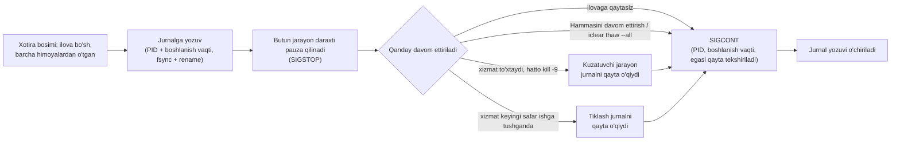
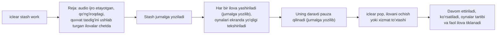

# iClear (avvalgi nomi iClean)

Xotirasi tugayotgan Mac'da fonda bo'sh turgan ilovalarni pauza qiladi va siz qaysi
biriga qaytsangiz, uni o'sha zahoti davom ettiradi. Hech qachon fayl o'chirmaydi.

[](https://github.com/urrra39/iClear/actions/workflows/ci.yml)
[](https://github.com/urrra39/iClear/releases/latest)
[](LICENSE)


> **Oxirgi reliz: 1.0.2.** Bitta Mac'da (Apple M3 Pro, 18 GB, macOS 27.0.1) laboratoriya
> ishga tushirgan haqiqiy ilovalar bilan tasdiqlangan, hech qachon shaxsiy akkauntlar bilan
> emas. `main` tarmog'ida **1.1.0-rc.1** ishi ham bor, u **chiqarilmagan**: quyida "faqat
> main" deb belgilangan narsa yuklab olinadigan versiyada yo'q. CI belgisi qizil, chunki
> 2026-10-06 dan beri GitHub birorta ham ishni ishga tushirmadi (akkauntdagi to'lov
> blokirovkasi), test yiqilgani uchun emas; mahalliy natijalar [QUALITY.md](docs/QUALITY.md)
> da. iClear **Kuzatish rejimida** boshlanadi: u faqat nima qilgan bo'lardi, shuni yozadi.
> [English](README.md) · [Holat va cheklovlar](#holat-va-cheklovlar) (hujjatlar ingliz tilida)

<p align="center"></p>

```text
$ iclear status
iClear observe mode, profile work. Mac Health 100/100 (good).
Memory pressure normal, 74% available, 2260 MB compressed, 0 MB swap. Forecast: stable.
Nothing frozen.
Observe mode: iClear only records what it would do.
$ iclear why
Mac Health: 100/100 (good). Forecast: stable.
Your Mac is healthy; iClear is idle.
```

Pauza qilingan ilova oynalari, tablari va saqlanmagan holatini saqlab qoladi; u
shunchaki ishlashdan to'xtaydi, shunda macOS u bilan RAM uchun kurashish o'rniga uning
xotirasini siqishi yoki svopga chiqarishi mumkin. Xotira bosimi me'yorida bo'lsa, iClear
hech narsa qilmaydi. U kesh, log yoki yuklanmalarni o'chirmaydi va xotira qo'shmaydi:
faqat mavjud xotirani qaysi ilovalar ishlatishini o'zgartiradi.

## Nega iClear

Har bir qator bitta Mac'dagi laboratoriya o'lchovi; N va sharoitlar havolada.

- **Ishdan chiqishga chidamli.** Har bir pauza amalga oshishidan oldin jurnalga yoziladi,
  xizmat to'xtab qolsa alohida kuzatuvchi (watchdog) hammasini davom ettiradi: `kill -9`
  dan keyin ilovalar pauzada bo'lgan 100/100 sinovda (p99 83 ms) va stash faol bo'lgan
  50/50 sinovda (p99 98 ms) har bir ilova 2 soniya ichida yana ishladi.
  [Dalil](docs/VALIDATION.md#crash-recovery-c2)
- **Haqiqiy ilovalarda sinalgan.** Chrome, VS Code, TextEdit va Preview'ning 1 200 pauza
  va davom ettirish sikli, 400 tasi sun'iy xotira bosimi ostida: 0 qotish, 0 crash hisobot,
  0 hujjat o'zgarishi. [Dalil](docs/VALIDATION.md#soak-on-real-apps-c1-c3-c4-c5-c6)
- **Tez davom etadi.** O'sha sikllarda ilova p99 da 15.1 ms ichida (maksimum 47.3 ms) yana
  javob berdi. [Dalil](docs/VALIDATION.md#soak-on-real-apps-c1-c3-c4-c5-c6)
- **Stash joylashuvni saqlaydi.** 4 ilovaning 50 stash/pop sikli: 350/350 oyna joyiga
  qaytdi, oldingi faol ilova 50/50 holatda oldinga qaytdi. [Dalil](docs/VALIDATION.md#stash-and-pop-c7)
- **Har bir pauzadan oldin himoyalar.** Audio ijro etilayotganda, qo'ng'iroq mikrofondan foydalanganda yoki
  yuklab olish ketayotganda 123 ta pauza urinishining 123 tasi rad etildi.
  [Dalil](docs/VALIDATION.md#guards-e2-every-freeze-attempt-during-audio-a-call-or-a-download-was-blocked)
- **Tuzilishidan maxfiy.** Root yo'q, yadro kengaytmasi yo'q, tarmoqqa ulanmaydi,
  telemetriya yo'q, ekranni yozib olmaydi; testlar mahsulot kodida tarmoq va imtiyoz
  API'lari yo'qligini tekshiradi. [Xavfsizlik modeli](docs/SAFETY.md)
- **Kuzatish rejimida boshlanadi va o'zini tushuntiradi.** Siz yoqmaguningizcha hech narsa qilmaydi;
  `iclear why`, `iclear explain <ilova>` va `iclear stats` nimani ko'rgani va nima qilgan
  bo'lishini aytadi. `iclear selftest` Mac'ingizda o'z sinov jarayonlari bilan 19 ta
  tekshiruv o'tkazadi (main; 1.0.2 da 13 ta). [Tasdiqlash](docs/VALIDATION.md#selftest-c13)
- **Ingliz va o'zbek tillarida**, menyuda ham, hujjatlarda ham.

## 60 soniyada boshlash

```sh
iclear selftest --quick # pauza va davom ettirish shu Mac'da ishlashini tez tekshiradi
iclear install          # foydalanuvchi xizmatini Kuzatish rejimida ishga tushiradi
iclear status           # u nimani ko'rmoqda va nima qilgan bo'lardi
iclear why              # Mac nega hozir sekin?
# ...Mac'ingizdan bir kun foydalaning, keyin:
iclear stats --days 1   # u nima qilgan bo'lardi va taxminiy afsus darajasi
iclear mode active      # unga amal qilishga ruxsat bering
```

Ilova bilan: iClear'ni Applications'dan oching; "iClear'ni ishga tushirish" xizmatni
o'rnatadi. **Favqulodda holat:** menyudagi "Hammasini davom ettirish", menyu ilovasi
ishlaganda Control-Option-Command-T yoki `iclear thaw --all`. Uchalasi ham iClear pauza
qilgan har bir ilovani davom ettiradi, xizmatsiz ham. `iclear selftest` bitta tekshiruv
uchun mikrofondan foydalanadi (o'z sinov vositasi, bir necha soniya, darhol tashlab
yuboriladi); `main` da `--no-mic` bu tekshiruvni o'tkazib yuboradi.

## Imkoniyatlar

| Imkoniyat | Sukut bo'yicha | Holati |
|---|---|---|
| Xotira bosimi ostida bo'sh fon ilovalarini pauza qilish va davom ettirish | `iclear mode active` gacha Kuzatish rejimi | chiqarilgan, tasdiqlangan (laboratoriya) |
| Stash: `iclear stash <nom>`, `iclear pop` | siz so'raganingizda | chiqarilgan, tasdiqlangan (laboratoriya) |
| Ilova sinflari va himoyalar (`iclear compat <ilova>`): chat, pochta, taqvim va media sukut bo'yicha pauza qilinmaydi; audio ijro etayotgan, mikrofon yoki kameradan foydalanayotgan, yuklab olayotgan yoki yozayotgan ilova pauza qilinmaydi | yoqilgan | chiqarilgan, tasdiqlangan (laboratoriya) |
| `iclear why`, Mac salomatligi bahosi, runaway himoyasi (faqat xabar beradi) | yoqilgan | chiqarilgan |
| `iclear selftest`, `iclear doctor`, `iclear before <ilova>`, hisobot, explain, Bekor qilish, profillar, Fokus xavfsiz rejimi | yoqilgan | chiqarilgan |
| Beachball tahlili (`iclear beachball`) | yoqilgan, Accessibility kerak | chiqarilgan |
| Batareya taxminlari (`iclear battery`) | "taxmin" belgisi bilan; maqsad rejimi o'chiq | chiqarilgan, **tasdiqlanmagan** |
| Qo'ng'iroq rejimi, Beachball yumshatish, issiqlik himoyasi | **o'chiq** | chiqarilgan, yoqish qoidalari bo'yicha o'chiq ([VALIDATION](docs/VALIDATION.md#paired-runs-c8)) |
| Auto-Context Stash (`iclear context`, `iclear hook`) | taklif rejimi | **faqat main**, tasdiqlanmagan |
| Xotira o'sishi tendensiyasi (`iclear leaks`) | faqat ro'yxat; bildirishnomalar o'chiq | **faqat main**, L5 qoidasi bo'yicha bildirishnomalar o'chiq |
| Panic Brake (`iclear brake`) | **faqat kuzatadi** | **faqat main**, laboratoriya mezonlari o'tmaguncha harakat qila olmaydi |
| Black Box (`iclear blackbox`), Thrash Guard, Wake-on-Data | **o'chiq** | **faqat main**, laboratoriya mezonlari o'tmaguncha o'chiq |
| Canary probe (`iclear probe`), Capacity Report (`iclear capacity`) | siz so'raganingizda | **faqat main**, tasdiqlanmagan |

Faqat main'dagi imkoniyatlar va ular nima qila olmasligi: [quyida](#maindagi-imkoniyatlar-chiqarilmagan).

## Xavfsizlik modeli



Himoyalangan to'plamni (tizim ilovalari, terminallar, dasturlash agentlari ishlaydigan
ilovalar, parol menejerlari, sinxronlash, VPN, kiritish va maxsus imkoniyat vositalari)
hech qanday qoida bilan pauza qilib bo'lmaydi. Daraxtlar "hammasi yoki hech biri"
tamoyili bilan pauza qilinadi; pauza 4 soat va RAM ning 50% bilan cheklangan; ustuvorlik
va yashirish o'zgarishlari jurnalga yoziladi va aynan qaytariladi. `main` da jurnal
barcha iClear jarayonlari bo'lishadigan qulfni ham oladi, yozuv esa jarayon yana ishlayotgani
ko'ringandagina yoki u yo'q bo'lgandagina o'chiriladi. Tafsilotlar va har bir qoidaning testi:
[SAFETY.md](docs/SAFETY.md).



## Tasdiqlangan doira

<details>
<summary><b>1.0.0 uchun 16 ta majburiy mezonning 16 tasi bitta Mac'da bajarildi; CI o'shanda macOS 15 (Apple Silicon va Intel) va macOS 26 da yashil edi.</b> Raqamlar uchun oching.</summary>

| Tasdiqlangan (laboratoriya, bitta Mac) | Natija |
|---|---|
| Haqiqiy ilovalarni (Chrome, VS Code, TextEdit, Preview) pauza qilish va davom ettirish: har biriga 300 sikl, 100 tasi 8 GB sun'iy bosim ostida | 0 qotish, 0 pauzada qolgan, 0 hujjat o'zgarishi, 0 crash hisobot; 15.1 ms ichida yana javob beradi (p99) |
| Ilovalar pauzada turganda xizmat `kill -9` bilan o'chirildi (100 marta) | 100/100 holatda 2 soniya ichida yana ishladi; p50 76 ms, p99 83 ms |
| Stash faol turganda xizmat `kill -9` bilan o'chirildi (50 marta) | 50/50 holatda 2 soniya ichida yana ishladi va ko'rsatildi; p50 85 ms, p99 98 ms |
| Stash va pop, 4 ilovaning 50 sikli | oynalar 0.0 nuqta aniqlikda joyida (350/350); oldingi faol ilova 50/50 holatda qaytdi; pauzada yoki yashirin qolgan yo'q |
| Pleyer ijro etganda, qo'ng'iroq mikrofondan foydalanganda yoki Chrome yuklab olganda himoyalar | 123 ta muzlatish urinishining 123 tasi rad etildi |
| 10-300 soniyalik pauzalar: Chrome tablari, chat mijozlari | ma'lumot yo'qolmadi; Chrome va heartbeat'li chat mijozi taxminan 1.1 soniyada tiklandi; heartbeat'siz mijoz oflayn qoldi (shuning uchun chat ilovalari himoyalangan) |
| "Sariq" (warning) bosimda muzlatilgan haqiqiy ilovalar qaytargan xotira (birinchi epizod) | Chrome 1 203 → 803 MB (−33%), VS Code 1 709 → 1 046 MB (−39%), Preview 130 → 84 MB (−35%); "me'yoriy" bosimda macOS kam qaytaradi (mediana −1% dan −4% gacha) |
| Pop: barcha yashirilgan ilovalar ko'ringuncha | p50 1.34 s, p99 1.36 s |
| Barcha imkoniyatlar yoqilgan 60 daqiqalik sinov, Faol laboratoriya xizmati | 0 xato: 12/12 stash/pop sikli, 6 bosim epizodi, 6/6 simulyatsiya qilingan qo'ng'iroq aniqlandi, 0 qotish |
| `iclear selftest` (to'liq) | 1.0.0: 13 tadan 13; main (1.1.0-rc.1 build): 19 tadan 19, o'tkazib yuborilgani yo'q |
| Testlar | 1.0.x: 188 ta, uchta CI runnerida yashil; main: 328 ta, mahalliy o'tadi (CI ishlamadi, yuqoriga qarang); ICCore qatorlarini qamrab olish 97.3% |

Barcha mezon va natijalar: [RELEASE_CRITERIA.md](docs/RELEASE_CRITERIA.md),
[VALIDATION.md](docs/VALIDATION.md), [QUALITY.md](docs/QUALITY.md). Testi yo'q hamma narsa
[TEST_MATRIX.md](docs/TEST_MATRIX.md) da sanab o'tilgan.

</details>

## Holat va cheklovlar

**Tasdiqlangan** (laboratoriya, bitta Mac): haqiqiy ilovalarni pauza qilish va davom
ettirish, ishdan chiqqandan keyin tiklash, stash va pop, himoyalar va quyidagi yon
ta'sirlar. Raqamlar: [Tasdiqlangan doira](#tasdiqlangan-doira).

**Tajribaviy yoki o'chiq, o'lchangan sababi bilan:**
- Qo'ng'iroq rejimi: qo'ng'iroq taymeri tebranishini kamaytirdi (p99 0.32 → 0.08 ms),
  lekin boshqa ilovalar ishini ikki baravar kamaytirdi, shuning uchun o'chiq.
- Beachball yumshatish: UI sinovini 3.4% yomonlashtirdi, shuning uchun o'chiq.
- Issiqlik himoyasi: sinab bo'lmadi, shuning uchun o'chiq.
- Batareya maqsad rejimi: batareyadan ishlagan holda yaroqli sinovlar yo'q, shuning
  uchun tajribaviy va o'chiq.
- `main` da: Panic Brake faqat kuzatadi; Black Box, Thrash Guard, Wake-on-Data va xotira
  o'sishi bildirishnomalari o'chiq, har biri oldindan belgilangan laboratoriya mezonlari
  o'tmaguncha ([RELEASE_CRITERIA_v1.1.md](docs/RELEASE_CRITERIA_v1.1.md)).

**O'lchangan zaif tomon: xizmatning protsessor yuki.** 1.0 ning 10 daqiqalik laboratoriya
sinovi bitta yadroning 0.48% va 40 MB ni o'lchadi (chegara 0.5%). 1.0.0 ning 7 kunlik
soak sinovi bu chegarani bajarmadi: kunlik o'rtacha bitta yadroning 0.73-2.03%
([soak W5](docs/VALIDATION.md#7-day-soak-on-100-final-result-w1-w7)). Asosiy sabab:
faqat ko'rsatiladigan, hech qachon amal qilinmaydigan prognoz bahosi bo'sh xotira prognoz
o'rgangan ogohlantirish darajasidan past bo'lganda xizmatni har 5 soniyada tekshirishga va
ilovalarning soket va fayllarini ko'rib chiqishga majbur qilardi. 1.0.2 va 1.1.0-rc.1 da
shunday; `main` da tuzatilgan (chiqarilmagan). O'sha Mac, Kuzatish rejimi, haqiqiy
ilovalar, kechasi 2 soat: rc.1 0.25%, `main` bitta yadroning 0.13-0.14%, soak
ma'lumotlaridan boshlanganda ham (rc.1 o'sha darajadan past 30 daqiqalik sinovda 0.95%
ishlatgan). Bir haftalik chegara `main` da qayta o'lchanmagan
([o'lchovlar](docs/VALIDATION.md#daemon-overhead-after-the-soak-w5-follow-up)).

**1.0.0 ning 7 kunlik soak sinovi** (2026-10-01 dan 2026-10-10 gacha): W1 o'tgan vaqt, W2
uyg'oq soatlar, W4 xavfsizlik (0 pauzada qolgan, 0 qotish) va W6 hisobotlar bajarildi;
**W3 bajarilmadi** (5 000 ta muzlatish/davom ettirishdan 5 148 tasi, lekin 300 ta
stash/pop'dan 160 tasi); **W5 bajarilmadi** (protsessor, yuqorida). Egasining 10 kunlik
haqiqiy ishida u bitta ilovani bir marta pauza qilgan bo'lardi, va o'sha pauza afsusga
sabab bo'lardi. [To'liq natija](docs/VALIDATION.md#7-day-soak-on-100-final-result-w1-w7)

**Tasdiqlanmagan** (yordamingiz kerak):
- Intel Mac'lar: u yerda faqat CI testlari ishladi ([#3](https://github.com/urrra39/iClear/issues/3)).
- macOS 13 va 14 ([#4](https://github.com/urrra39/iClear/issues/4)).
- 8 GB va undan kam xotirali Mac'lar ([#5](https://github.com/urrra39/iClear/issues/5)).
- Pauza nishoni sifatida Safari ([#6](https://github.com/urrra39/iClear/issues/6)), Docker va Xcode ([#7](https://github.com/urrra39/iClear/issues/7)) hamda virtual mashinalar.
- Haqiqiy Slack, Spotify yoki istalgan shaxsiy akkaunt ([#9](https://github.com/urrra39/iClear/issues/9)); [MANUAL_TESTS_APPS.md](docs/MANUAL_TESTS_APPS.md).
- Auto-Context hook bilan fish va tmux ([#8](https://github.com/urrra39/iClear/issues/8)).
- Batareya taxminlari; saqlanmagan o'zgarishlar signali (laboratoriyada hech bir ilova
  uni bermadi); pauzadagi pleyerga yuborilgan media tugmalari; issiqlik himoyasi.
- Faqat main'dagi imkoniyatlarning laboratoriya bosqichlari (4-6) va sig'im benchmarki:
  hali o'tkazilmagan.
- Developer ID imzosi va notarizatsiya: qilinmagan ("O'rnatish" ga qarang).

**Qachon yordam bermaydi:** xotira bosimi yashil (macOS o'zi uddalaydi, iClear hech narsa
qilmaydi); xotirani siz ishlatayotgan ilova yoki to'xtamasligi kerak bo'lgan narsa (build,
model, virtual mashina, qo'ng'iroq) egallagan; uyg'onmasdan jim turgan ilovalar (macOS
ularni baribir siqadi); yoki kundalik ishingiz uchun RAM shunchaki yetmaydi (bir haftalik
ma'lumotdan keyin `iclear advise` buni aytadi).

<details>
<summary><b>Pauza ilovalarga nima qiladi</b> (o'lchangan yon ta'sirlar va ular sabab bo'lgan sukut sozlamalari)</summary>

Simulyatorlar va mahalliy sahifalardagi Chrome bilan o'lchangan
([VALIDATION.md](docs/VALIDATION.md), "Side effects"); `iclear compat <ilova>` ularni
bitta ilova uchun ko'rsatadi.

- **Chat, pochta va taqvim ilovalari** siz o'zingiz yoqmaguningizcha hech qachon pauza
  qilinmaydi. Pauzadagi ilova hech narsa qabul qilmaydi, u javob bermay qo'ygach esa
  server ulanishni uzadi (laboratoriya serveri 30 soniyadan keyin). O'z "yurak urishi"
  (heartbeat) tekshiruvi bor simulyatsiya qilingan mijoz davom ettirilgandan keyin
  taxminan 1.1 soniyada qayta ulandi va o'tkazib yuborilgan barcha xabarlarni kechikib
  (300 soniyalik pauzadan keyin 296 soniyagacha) oldi, birortasi ham yo'qolmadi. Uzilishni
  faqat soketdan bilishga tayanadigan mijoz 60 soniya va undan uzun har bir pauzadan
  keyin **oflayn qolib ketdi**. Ixtiyoriy "uyg'onish oynalari"
  (`packaging/rules/chat-wake-windows.json`) laboratoriyada eng katta kechikishni 296
  soniyadan 36 soniyaga qisqartirdi, evaziga ilova tez-tez uyg'onadi; qo'ng'iroq paytida
  ular qayta muzlatilmaydi.
- **Media pleyerlar** sukut bo'yicha hech qachon pauza qilinmaydi: ijro paytida ham,
  undan keyingi 10 daqiqada ham. Pauzadagi pleyer media tugmalari yoki Boshqaruv
  markaziga javob bera olmaydi; bunda macOS nima qilishi qo'lda tekshiriladi.
- **Brauzerlar** faqat butun daraxt sifatida va hech bir tab audio ijro etmayotgan,
  mikrofon yoki kameradan foydalanmayotgan, yuklab olmayotgan, fayl yozmayotgan va quvvat
  tasdig'ini ushlab turmagan paytda pauza qilinadi (WebRTC ulanishi ochiq turganda Chrome
  shunday tasdiqni ushlab turadi). Laboratoriyada bu himoyalar sinov Chrome'ini pauza
  qilishga bo'lgan har bir urinishni rad etdi. Laboratoriya uni baribir 10-300 soniyaga
  pauza qilganda, har bir sahifa davom ettirilgandan keyin 0.03 soniya ichida javob berdi,
  formadagi ma'lumot va taymerlar saqlanib qoldi, WebSocket sahifalari 1.1 soniya ichida
  qayta ulandi, WebRTC ma'lumot kanali va service worker ishlashda davom etdi. Chrome'ning
  o'zi ham Energy Saver yoqilganda yashirin, protsessorni ko'p ishlatadigan tablarni
  muzlatadi (Page Lifecycle "frozen" holati, Chrome 133 va undan keyingi) va Memory Saver
  rejimida faol bo'lmagan tablarni xotiradan chiqaradi, ularga qaytganingizda qayta
  yuklanadi.
- **"Not Responding" (javob bermayapti)**: pauza paytida ilova Force Quit, Activity Monitor
  yoki Dock menyusida "Not Responding" bo'lib ko'rinishi mumkin. Pauzadagi jarayon shunday
  ko'rinadi; uni faollashtirsangiz davom etadi. Uni majburan yopmang.
- **Soat va taymerlar**: pauza paytida vaqt o'tishda davom etadi. Davom ettirilgandan
  keyin takrorlanuvchi taymer bir marta ishlaydi (bir yo'la ko'p marta emas), pauzani qamrab
  olgan kutish muddatlari esa darhol tugaydi.
- **Uzilgan ulanishlar**: serverlar o'zlariga javob bermay qo'ygan ulanishlarni yopadi;
  qayta tiklanish ilovaning o'ziga bog'liq (ko'pchilik chat ilovalari qayta ulanadi,
  yuqoriga qarang). Yuklab olishlar himoyalangan: 200 MB yuklab olish to'g'ri nazorat
  yig'indisi (checksum) bilan tugadi, pauza qilishga bo'lgan har bir urinish esa rad etildi.
- Pauza paytiga to'g'ri kelgan **bildirishnomalar** kechikib chiqadi yoki umuman chiqmaydi
  (o'lchanmagan).

</details>

### Ruxsatlar

| Ruxsat | Majburiymi? | Nima uchun | Rad etilsa |
|---|---|---|---|
| hech qanday | | pauza, davom ettirish, stash, `why`, salomatlik bahosi, himoyalar, qo'ng'iroqni aniqlash (iClear mikrofon yoki kamera *ishlatilayotganini* biladi, xolos; ovoz yoki tasvirni hech qachon olmaydi) | hammasi ishlaydi |
| Maxsus imkoniyatlar (Accessibility) | ixtiyoriy | davom ettirilgan ilova javob berishini tekshirish; kechikish; qotib qolish tahlili; pop'dan keyin aynan oldingi ilovani oldinga chiqarish. Stash shu yo'l bilan saqlanmagan o'zgarishlarni ham so'raydi, lekin laboratoriyada hech bir ilova ularni bildirmadi (har biri "noma'lum" bo'ldi), shuning uchun bu tekshiruv tasdiqlanmagan | davom ettirishdan keyingi qotish aniqlanmaydi; kechikish va qotishlar "o'lchanmagan" |
| Kiritishni kuzatish (Input Monitoring) | ixtiyoriy | tajribaviy oldindan davom ettirish (o'chirilgan) | hech narsa o'zgarmaydi |
| Mikrofon | faqat `iclear selftest` uchun | uning qo'ng'iroq tekshiruvi iClear'ning o'z sinov vositasini ishga tushiradi, u bir necha soniya yozib, darhol tashlab yuboradi | o'sha tekshiruv o'tkazib yuboriladi (main'da `--no-mic`) |
| Ekranni yozib olish, Kamera | ishlatilmaydi | | |

## O'rnatish

macOS 13 va undan yangilari, Apple Silicon va Intel uchun qurilgan (universal ikkilik
fayl); faqat [COMPATIBILITY.md](docs/COMPATIBILITY.md) da sanab o'tilgan sharoitlarda
sinalgan.

[Oxirgi relizni](https://github.com/urrra39/iClear/releases/latest) **yuklab oling**:
`iClear-<versiya>.zip` (menyu ilovasi; buyruq qatori vositalari
`iClear.app/Contents/Helpers` ichida) yoki `iclear-<versiya>-macos.tar.gz` (faqat buyruq
qatori vositalari). Tekshiring:

```sh
shasum -a 256 -c SHA256SUMS.txt --ignore-missing
```

Buildlar ad-hoc imzolangan, notarizatsiyadan o'tmagan, shuning uchun Gatekeeper birinchi
ishga tushirishni to'xtatadi. macOS 15 va undan keyingisida: iClear.app ni bir marta oching,
keyin System Settings > Privacy & Security > Open Anyway (Apple o'ng tugma yo'lini macOS 15
da olib tashlagan). macOS 13 va 14 da: iClear.app ni o'ng tugma bilan bosing, Open ni
tanlang va tasdiqlang. Buyruq qatori vositalari: `xattr -dr com.apple.quarantine
iclear-<versiya>`, keyin uning ichida `./iclear install`.

**Manba koddan** (Swift 6; `main` chiqarilmagan 1.1.0-rc.1 ishini quradi):

```sh
git clone https://github.com/urrra39/iClear.git && cd iClear
scripts/build-release.sh           # universal ikkilik fayllar, dist/iClear.app
cp -R dist/iClear.app /Applications/
```

Homebrew tap hali chiqarilmagan ([#11](https://github.com/urrra39/iClear/issues/11));
shablonlar [`packaging/homebrew/`](packaging/homebrew/) da.

### O'chirib tashlash

```sh
iclear uninstall --purge   # xizmatni to'xtatadi (hammasini davom ettiradi), LaunchAgent ni
                           # olib tashlaydi va ~/Library/Application Support/iClear ni o'chiradi
rm -rf /Applications/iClear.app
```

### iClean dan o'tish

iClear bu iClean ning yangi nomi. Agar iClean 0.1.0 o'rnatilgan bo'lsa, `iclear install`
(yoki `iclear migrate`) avval iClean pauza qilgan hamma narsani davom ettiradi (agar
uning xizmati ishlayotgan bo'lsa u orqali, keyin muzlatish jurnalini qayta o'qib), faqat
shundan keyin eski LaunchAgent ni to'xtatadi va o'chirib qo'yadi hamda sozlamalar, holat
va izlarni nusxalaydi. Agar eski jurnaldagi jarayon hali ham pauzada bo'lsa, hech narsani
o'zgartirmasdan to'xtaydi. Eski fayllar `iclear migrate --remove-old` ni ishga
tushirmaguningizcha joyida qoladi. `iclear migrate --dry-run` avval rejani ko'rsatadi.

## Main'dagi imkoniyatlar (chiqarilmagan)

<details>
<summary>Auto-Context Stash, xotira o'sishi tendensiyasi, Panic Brake, Black Box, canary probe, Capacity Report, Wake-on-Data, Thrash Guard: har biri nima qiladi va nima qila olmaydi</summary>

Ularning laboratoriya sinovlari ([RELEASE_CRITERIA.md](docs/RELEASE_CRITERIA.md) 4-bosqich,
[RELEASE_CRITERIA_v1.1.md](docs/RELEASE_CRITERIA_v1.1.md) 5 va 6-bosqichlar) hali
o'tkazilmagan. Imkoniyat mezonlari o'tmaguncha, standart o'rnatish uni sozlamadan qat'i
nazar faqat kuzatish rejimida yoki o'chiq holda ishlatadi.

- **Auto-Context Stash** (`iclear hook zsh|bash|fish`, `iclear context add | list |
  remove | status | pause | resume | undo | suggest`). Kichik shell hook iClear'ga
  terminalingiz qaysi papkada ekanini aytadi. Boshqa loyihada 20 soniya o'tgach, iClear
  bitta almashtirishni *taklif qiladi*: tark etilgan loyiha ilovalarini yashiradi
  (`context:<nom>` sifatida) va yangi loyiha ilovalarini qaytaradi. Ikkala loyiha
  ishlatadigan ilovalar, shuningdek pauza qilib bo'lmaydigan ilovalar (audio, mikrofon,
  qo'ng'iroq) ishlashda davom etadi; qat'iy to'siq (masalan, diskda joy yetmasligi)
  butun almashtirishni to'xtatadi. Avtomatik almashtirish har bir kontekst uchun alohida
  yoqiladi va faqat Faol rejimda ishlaydi; Kuzatish rejimi faqat "almashtirgan bo'lardi"
  deb yozadi. Loyiha ichidagi ko'chishlar, `cd ~` va `/tmp` almashtirmaydi; har bir
  almashtirishdan keyin 5 daqiqalik tanaffus bor; `iclear context undo` oxirgisini bekor
  qiladi. Almashtirish bir zumda bo'lmaydi: taxminan qaytarish (pop) qancha vaqt olsa,
  shuncha oladi (1.0 laboratoriyasida p50 1.34 s). Cheklovlar: faqat terminallarni
  ko'radi, shuning uchun faqat IDE ichida qilingan ish ko'rinmaydi; turli loyihalardagi
  terminallar kutish vaqti ichida xabar bersa, joriy kontekst o'zgarmaydi; fish, tmux
  va boshqa multiplekserlar sinalmagan. Dastlabki tajribada hook har bir papka
  almashishiga taxminan 1-2 ms qo'shdi (zsh va bash).
- **Xotira o'sishi tendensiyasi** (`iclear leaks`; menyuda: O'sish). Har bir ilovaning
  xotira hajmini daqiqasiga bir marta o'lchaydi va ilova ishlatilmayotganda (oxirgi 10
  daqiqada oldingi planda bo'lmagan) barqaror o'sishni kamida 2 soat va 12 o'lchovdan
  keyin xabar qiladi: "soatiga X MB o'sish (oraliq), shu tezlikda HH:MM atrofida Y GB",
  ishonch darajasi bilan. Bu tendensiya, xotira oqishi tashxisi emas: keshlar va loglar
  ham o'sadi. Bir martalik sakrash (hujjat ochilgan) va to'lib-bo'shaydigan keshlar
  xabar qilinmaydi. Xotira bosimi bilan faqat tizim prognozi orqali bog'lanadi va u
  "taxmin" deb belgilanadi. Tarix xotirada saqlanadi va daemon qayta ishga tushganda
  qaytadan boshlanadi. Bildirishnomalar o'chiq: soak'ning 10 kunlik izidagi orqaga
  qaytib tekshiruv hech bir ilovani belgilamadi, shuning uchun L5 qoidasi undan o'ta
  olmaydi. `iclear leaks quit <ilova>` avval nima bo'lishini
  ko'rsatadi; `--yes` bilan ilovadan o'zining Quit buyrug'i orqali yopilishni so'raydi
  va uni majburan yopmaydi. "Tozalash" tugmasi yo'q: macOS'da boshqa ilovani xotira
  bo'shatishga yoki axlat yig'ishga majburlash usuli yo'q.
- **Panic Brake** (`iclear brake observe | on | off | status | report | resume | quit`).
  Alohida kichik kuzatuvchi (`icbrake`, o'z LaunchAgent'i, AppKit'siz) har 250 ms da
  xotira bosimi, svopdan qaytarishlar, siqilgan xotirani ochish, sahifa yuklanishlari,
  navbat va o'z taymeri kechikishini o'qiydi. Mac xotira tufayli qotib qolsa, u sizning
  jarayon daraxtlaringizni xotira o'sishi, sahifa yuklanishi va protsessor bo'yicha
  saralaydi va eng yuqorisini pauza qilgan bo'lardi (avval jurnalga yozib); qotish o'tsa,
  uni pauzada qoldiradi, aks holda davom ettirib keyingisini sinaydi (3 tagacha), 10 s da
  to'xtab xabar beradi. Oldingi plandagi ilova faqat 10 s dan keyin va faqat eng yuqorida
  bo'lsa nomzod bo'ladi. **Bu versiyada u faqat kuzatadi:** `iclear brake on` saqlanadi,
  lekin mezonlari o'tmaguncha uni harakatga keltirmaydi. Ixtiyoriy, har bir ilova uchun
  alohida va standart holatda o'chiq: `brake.autoQuitApps` ro'yxatidagi ilova 30 s
  davomida tasdiqlangan sababchi bo'lib qolsa, undan o'zining Quit buyrug'i bilan
  yopilish so'raladi (xizmat orqali boshidan oxirigacha sinalgan); ilova saqlanmagan ish
  borligini bildirsa, bu qadam o'tkazib yuboriladi, lekin 1.0 laboratoriyasida hech bir
  ilova bu signalni bermadi, shuning uchun ishonchli signali yo'q ilova saqlanmagan ishni
  yo'qotishi mumkin: faqat avtomatik saqlaydigan va oynalarini tiklaydigan ilovalarni
  yoqing. Yadro, GPU/drayver yoki WindowServer qotishlari, apparat nosozliklari va root
  jarayonlari (Spotlight `mds`, Time Machine `backupd`, `kernel_task`) uning qo'lidan
  kelmaydi, to'liq qotib qolgan Mac'ni hech qanday ilova qutqara olmaydi. Mac'ni
  qanchalik tez tiklashi hali o'lchanmagan.
- **Black Box** (`iclear blackbox`). Oxirgi ~5 daqiqa, 2 s oralig'ida (bosim, svop,
  sahifa yuklanishlari, harorat va quvvat holati, eng shubhali ilovalar nomi), faqat Mac
  sog'lom bo'lmaganda yoziladi. To'g'ri o'chirilmasdan qayta ishga tushgandan keyin menyu
  va `iclear blackbox` o'sha vaqt chizig'ini ko'rsatadi. Oxirgi bir necha soniya
  yo'qolishi mumkin. macOS'ning "Previous shutdown cause" yozuvi faqat foydalanuvchi uni
  o'qiy olsa ko'rsatiladi; sinov Mac'ida o'qib bo'lmaydi.

- **Canary probe** (`iclear probe <ilova> [--cycles N]`). Sizning roziligingiz bilan
  (so'rovda), faqat ilova yashirin, oldingi planda emas, barcha himoyalardan o'tgan va Mac
  zaryadda bo'lganda: bir necha qisqa jurnalli pauza (standart 5 ta, har biri ko'pi bilan
  5 s); har bir davom ettirishdan keyin ilova tirikligini, javob berishini (Accessibility
  bilan, oynasi bor ilovalar uchun) va ulanishlari saqlanganini tekshiradi, yangi
  nosozlik hisobotlarini qidiradi. Muvaffaqiyatsizlik ilovani karantinga oladi;
  `probe.requirePassed` (o'chiq) avtomatik pauzalarni faqat sinovdan o'tgan ilovalarga
  cheklaydi. Ilovani oldinga chiqarsangiz sinov to'xtaydi va ilova davom etadi.
- **Capacity Report** (`iclear capacity [--json]`, menyu qatori). Har bir pauza uchun
  60 s dan keyin bo'sh xotiraning o'lchangan o'zgarishi, pauzadagi hajm, vaqt va
  afsuslar; ogohlantirishgacha qolgan zaxira taxmini (oraliq bilan); svop va uning
  24 soatlik o'zgarishi; pauza bo'lmasa "xabar qiladigan narsa yo'q". Nimani o'zgartira
  oladi va nimani yo'q: [CAPACITY.md](docs/CAPACITY.md). Laboratoriya natijasi hali e'lon
  qilinmagan.
- **Wake-on-Data** (`wakeOnData`, **o'chiq**, faqat tanlangan chat yoki brauzer ilovasi
  uchun). Bunday ilova pauzada bo'lganda iClear har 250 ms da uning soketlaridagi qabul
  navbatini tekshiradi (libproc, root kerak emas); ma'lumot kutayotgan bo'lsa ilovani
  davom ettiradi (`WAKE_DATA_RX`) va ma'lumot to'xtagach 5 s dan keyin yana pauza qiladi
  (`REFREEZE_QUIET`), agar qo'ng'iroq, audio yoki boshqa himoya to'sqinlik qilmasa. Vaqtning
  20% dan ko'pida davom ettirilgan ilova ishlab turaveradi. Qamrab olinmaydi: Apple push
  bildirishnomalari, trafigi boshqa jarayon orqali o'tadigan ilovalar (VPN, proksi, tarmoq
  kengaytmasi; qo'llab-quvvatlanmaydi deb belgilanadi), tizim ko'rmaydigan QUIC. Hali
  o'lchanmagan.
- **Thrash Guard** (`thrash.enabled`, **o'chiq**). Fon ilovalari tez-tez uyg'onib sovuq
  xotiraga tegsa, Mac doimiy sahifa yuklaydi va oldingi plandagi ilova qotadi. Bunday
  holatda (sahifa yuklanish bo'roni va ogohlantiruvchi bosim yoki qotish, ketma-ket
  o'lchovlarda) o'z sahifa yuklanishi eng yuqori bo'lgan fon ilovalari odatdagi jurnalli
  yo'l bilan pauza qilinadi (`THRASH_PAGEIN`); "protsessor bo'yicha bo'sh" shartidan
  boshqa barcha himoyalar amal qiladi. Oldindan belgilangan laboratoriya mezonlari (T1-T4)
  o'tmaguncha o'chiq qoladi; hali o'lchanmagan.

Ikkalasi uchun mavjud ishlar ([NOVELTY.md](docs/NOVELTY.md#v11-re-audit-2026-10-02),
2026-10-02 da qidirilgan): ish muhiti vositalari ilovalar guruhini tugma bilan ochadi va
yopadi (Bunch, Commute, Ikuna, ShiftPlus), autohide esa ishlatilmayotgan ilovalarni
yashiradi; xotira o'sishi tendensiyasining statistikasi (Mann-Kendall va Sen qiyaligi)
ma'lum usul, boshqa Mac vositalari ham o'sayotgan ilovalarni belgilaydi (RamRadar, Memory
Monitor, Mac Performance Monitor). Panic Brake uchun: earlyoom Linux'da eng katta jarayonni
o'chirib xuddi shu vazifani bajaradi; memory_guard.py macOS'da siz ko'rsatgan jarayon
daraxtlarining yaratuvchilarini pauza qiladi, keyin ishchilarni o'chiradi; turnstile
bosim ostida o'z vazifalarini o'chirishdan oldin pauza qiladi.

</details>

## Boshqalar bilan taqqoslash

<details>
<summary>O'xshash muammolarni hal qiladigan loyihalar, ularning bir nechtasi ilgariroq (har bir qator 2026-10-03 da qayta o'qildi)</summary>

| Loyiha | Yondashuv | iClear dan farqi |
|---|---|---|
| [ForceNap](https://github.com/omikun/ForceNap) | Siz tanlagan ilovalarni fokusdan chiqqanda to'xtatadi, fokusga qaytganda davom ettiradi | Oddiy va to'g'ridan-to'g'ri. U tanlangan ilovalarni xotira bosimidan qat'i nazar to'xtatadi; iClear faqat bosim ostida harakat qiladi va ilovalarni o'zi tanlaydi |
| [Auto Pause Mac Apps](https://github.com/fazalrshah/auto-pause-mac-apps) | Ilovalarni pauza qilib RAM ni qaytarish uchun menyu ilovasi, holatni saqlab yopadigan "Deep Sleep" rejimi bilan | Qo'lda boshqarish qulay va iClear da yo'q holatni saqlab yopish rejimi bor. iClear avtomatik, bosimga asoslangan va himoyalar bilan tekshiriladi |
| [caproom](https://github.com/intelogroup/caproom) | Buyruqlar uchun xotira chegarasi; bo'sh jarayon daraxtlarini SIGSTOP bilan "to'xtatib qo'yadi", chegaradan oshsa o'chiradi | Terminal ishlari va agentlar uchun qat'iy chegaralar bilan qurilgan. iClear GUI ilovalarni nishonga oladi va hech qachon o'chirmaydi |
| [ProcessX](https://github.com/avantigroupai/ProcessX) | Jarayon/ustuvorlik monitori; protsessorni to'xtatib-davom ettirish orqali cheklaydi | Protsessor va ustuvorlikka qaratilgan. iClear xotira bosimiga qaratilgan |
| [GreenRAM](https://github.com/lwj1994/greenram) | RAM/svop chegarasidan oshganda uzoq bo'sh turgan fon ilovalarini majburan yopadi | Yopish barcha xotirani bo'shatadi, lekin holat yo'qoladi. iClear pauza qiladi va holatni saqlaydi |
| [Canaryd](https://github.com/ThaddeusJiang/canaryd) | To'xtab qolgan xizmatlar, Simulator, qizish va bo'sh xotira uchun kuzatuvchi; bo'sh og'ir ilovalardan yopilishni so'raydi | Dasturchi kompyuteri uchun kengroq kuzatuvchi. iClear yopish o'rniga pauza qiladi |
| [MemoryShield](https://github.com/MaatheusGois/MemoryShield) | Har bir jarayon xotira tarixi; chegaradan oshganda avtomatik o'chira oladi | Tarix va ogohlantirishlar u yerda ham bor. iClear o'chirmaydi |
| [mac-memory-guard](https://github.com/TomGranot/mac-memory-guard) | Xotira tufayli qotishdan oldin ogohlantiradi va ilovalarni birma-bir yopishga imkon beradi | Avval ogohlantiradi, qarorni inson qiladi. iClear o'zi harakat qiladi |
| [WattMate](https://wattmateapp.com/) | Ilovalar quvvatini batareya daqiqalariga aylantiradi, oldin/keyin o'lchovi bilan | Batareya daqiqalari va "nima qaytardi" o'lchovi u yerda allaqachon bor; iClear'ning batareya taxminlari yangi emas va tasdiqlanmagan |
| [AppHalt](https://apphalt.app/) ([README](https://github.com/Gabrielnion/AppHalt)) | Siz tanlagan ilovalarni menyu panelidan pauza qilish va davom ettirish, oynalar va hujjatlar saqlanadi; pullik Pro versiyada bo'sh turgandan keyin avtomatik pauza va "hech qachon pauza qilinmasin" ro'yxati bor | Qo'lda boshqarish va ilovalar bo'yicha qoidalar qulay. iClear xotira bosimi va har bir ilova himoyalari asosida qaror qiladi, Kuzatish rejimida boshlanadi |
| [MacFreeze](https://github.com/exadeci/mac_freeze) | Glob naqshlariga mos ilovalarni har biri uchun belgilangan bo'sh vaqtdan keyin muzlatadi (SIGSTOP/SIGCONT), o'zi yopilganda hammasini davom ettiradi | Oddiy va sozlanadigan, xotira bosimidan qat'i nazar muzlatadi. iClear bosim ostida harakat qiladi, avval audio, qo'ng'iroq, ulanish va yozishni tekshiradi, har bir pauzani jurnalga yozadi |
| [wintertime](https://github.com/actuallymentor/wintertime-mac-background-freezer) | Ro'yxatidagi ilovalarni fokusdan chiqqanda muzlatadi (`pkill` orqali), batareyani tejash uchun; hammasini davom ettiradigan favqulodda tugmasi bor; macOS 10.13 da sinalgan | Fokusga va batareyaga qaratilgan. iClear bosimga asoslanadi va o'zi ishdan chiqsa ham jurnaldan tiklaydi |
| [ShiftPlus](https://shiftplus.app/blog/shift-mac/) | Tugma bilan ish to'plamini almashtiradi: to'plamga kirmagan ilovalarni yopadi yoki yashiradi, keraklilarini brauzer profillari, Spaces va terminal o'zgaruvchilari bilan ochadi | Ish to'plamini ilovalarni yopib-ochib qayta quradi. iClear stash ilovalarni joyida yashirib pauza qiladi va holatini saqlaydi; brauzer profillari yoki Spaces'ni boshqarmaydi |
| [ContextResume](https://github.com/yigitbozyaka/ContextResume) | Har bir git branch uchun eslatma (git holati, oxirgi xato bergan buyruq, niyatingiz), branch almashganda shell prompt hook orqali ko'rsatadi | Nima qilayotganingizni eslab qoladi, qaysi ilovalar ochiq bo'lganini emas; ilovalarni pauza qilmaydi va boshqarmaydi |
| [direnv](https://direnv.net/) | Shell hook orqali har bir katalog uchun muhit o'zgaruvchilarini yuklaydi va olib tashlaydi | Yondosh, boshqa muammo: ilovalar emas, shell muhiti |
| [SceneShift](https://tandukuda.github.io/SceneShift/) | Faqat Windows: ilovalar to'plamini o'chiradigan, to'xtatadigan, davom ettiradigan yoki qayta ochadigan terminal vositasi, bekor qilish bilan | Windows'dagi o'xshash to'xtatish-tiklash g'oyasi; iClear macOS uchun va xotira bosimiga qarab ishlaydi |
| [earlyoom](https://github.com/rfjakob/earlyoom) (Linux) | Bo'sh xotira va svop 10% dan tushganda eng katta jarayonni o'chiradi (SIGTERM, keyin SIGKILL); mlockall, taxminan 2 MiB | Panic Brake macOS'da shu g'oyaga amal qiladi, lekin o'chirish o'rniga pauza qiladi va jurnal yuritadi |
| [memory_guard.py](https://gist.github.com/jlevy/5b43e0d44166b9c7fe8157ee938cb0d5) | Siz ko'rsatgan jarayon daraxtlari uchun macOS kuzatuvchisi: kuzatish, mashq, faqat pauza va to'liq rejimlar; yaratuvchilarni pauza qiladi, keyin ishchilarni o'chiradi | Usuli yaqin. Panic Brake barcha jarayon daraxtlaringizni saralaydi, hech narsani o'chirmaydi va har bir pauzani qotishga qarab tekshiradi |
| [turnstile](https://github.com/mcclowes/turnstile) | Vazifalar ishga tushirgichi: xotira chegarasidan oshgan vazifa bosim ostida pauza qilinadi, bosim 15 s davom etsagina o'chiriladi | Faqat o'z vazifalari bilan ishlaydi |
| [Bunch](https://bunchapp.co/) | Ilovalarni ochadigan, yopadigan va skript ishga tushiradigan matnli "Bunch"lar, menyudan | Qo'lda ochadi va yopadi; Auto-Context terminalingizdagi loyiha o'zgarganda ilovalar guruhini pauza qiladi |
| [Commute](https://apps.apple.com/app/id1564572231) | Ilovalar to'plamini ochib, boshqalarini yopadigan profillar, tugma bilan | Bunch bilan bir xil farq |
| [Ikuna](https://www.brnsft.com/blog/best-mac-apps-for-project-switching-save-browser-tabs-apps-and-files-instantly-in-2026) | Joriy ish muhitini yopib, boshqasini tiklaydi (ilovalar, tablar, oyna joylari), tugma bilan; nashriyotchi aytishicha "uch soniyadan kam" | Yopib qayta ochadi; iClear joyida pauza qiladi |
| [RamRadar](https://github.com/gemscng/RamRadar) | Oldingi tekshiruvdan beri kamida 1 GB va 50% o'sgan dasturlarni belgilaydi va so'rov bilan to'xtatadi | Ikki o'lchovli chegara va yopish; xotira o'sishi tendensiyasi bo'sh holatdagi o'lchovlar bo'yicha barqaror tendensiyadan foydalanadi va majburan yopmaydi |
| [Mac Performance Monitor](https://github.com/Zesty0wl/mac-performance-monitor) | Menyu panelidan protsessor, xotira, GPU, tarmoq va batareyani yozadi; o'sish tekshiruvlari tashxis emas, kuzatuv sifatida | Faqat kuzatish |
| Windows [ControlChannelTrigger](https://learn.microsoft.com/en-us/uwp/api/Windows.Networking.Sockets.ControlChannelTrigger?view=winrt-22621) | To'xtatilgan Windows ilovasiga TCP ulanishni saqlash va ma'lumot kelganda uyg'onish imkonini beradi | Wake-on-Data g'oyasi shundan; macOS'da iClear pauzadagi ilovaning qabul navbatini tashqaridan, ilovaning yordamisiz kuzatadi |
| [amphetamine](https://github.com/GriffinCanCode/amphetamine) (Rust crate) | Apple Silicon buyruq qatori: ilovalardan yopilishni so'raydi (majburan o'chirmaydi), raqib jarayonlarni `nice` bilan faqat aniq tiklay olsagina pasaytiradi, svop nega qolishini tushuntiradi, ikki papkadagi eski keshlarni o'chiradi | Pauza o'rniga yopadi va kesh o'chiradi; iClear pauza qiladi, holatni saqlaydi va fayl o'chirmaydi. Ikkalasi ham ustuvorlik o'zgarishini aynan qaytaradi |

2026-10-03 holatiga ko'ra, biz bosim uchun ETA prognozi, afsusni hisobga oluvchi
muzlatish, pauzadan oldingi ulanish/yozish himoyalari, davom ettirishdan keyingi
karantin yoki iz qayta ijrosini bu loyihalarda ham, GitHub va veb qidiruvlarimizda ham
topmadik ([NOVELTY.md](docs/NOVELTY.md)). Chrome'ning o'zi Energy Saver rejimida yashirin,
ovozsiz va protsessorni ko'p ishlatadigan tablarni muzlatadi (Chrome 133 dan) va Memory
Saver rejimida tablarni o'chiradi, brauzer ichida. Dalil yo'qligi isbot emas: topilmagani
mavjud emasligini anglatmaydi.

</details>

## Hujjatlar

[Arxitektura](docs/ARCHITECTURE.md) · [Xavfsizlik](docs/SAFETY.md) ·
[Tasdiqlash natijalari](docs/VALIDATION.md) · [Reliz mezonlari](docs/RELEASE_CRITERIA.md) ·
[v1.1 mezonlari](docs/RELEASE_CRITERIA_v1.1.md) · [Testlar xaritasi](docs/TEST_MATRIX.md) ·
[Moslik](docs/COMPATIBILITY.md) · [Sifat](docs/QUALITY.md) ·
[Imkoniyatlarni o'rganish](docs/FEASIBILITY.md) · [Qarorlar](docs/DECISIONS.md) ·
[Savol-javob](docs/FAQ.md) · [O'zgarishlar](CHANGELOG.md)

## Hissa qo'shish

Xato haqida xabarlar, moslik hisobotlari va kichik, aniq pull request'lar mamnuniyat bilan
qabul qilinadi; eng foydalisi Mac'ingizda `iclear selftest --report` ni ishga tushirib,
natijani yuborish ([ochiq vazifalar](https://github.com/urrra39/iClear/issues?q=is%3Aissue+is%3Aopen+label%3A%22help+wanted%22)).
[CONTRIBUTING.md](CONTRIBUTING.md) va [SECURITY.md](SECURITY.md) ga qarang.

## Litsenziya

MIT litsenziyasi. Apple Inc. bilan bog'liq emas. macOS va MacBook Apple Inc.ning
savdo belgilaridir. iClear shunga o'xshash nomli kesh va disk tozalagichlar bilan
bog'liq emas ([NAMING.md](docs/NAMING.md)).
